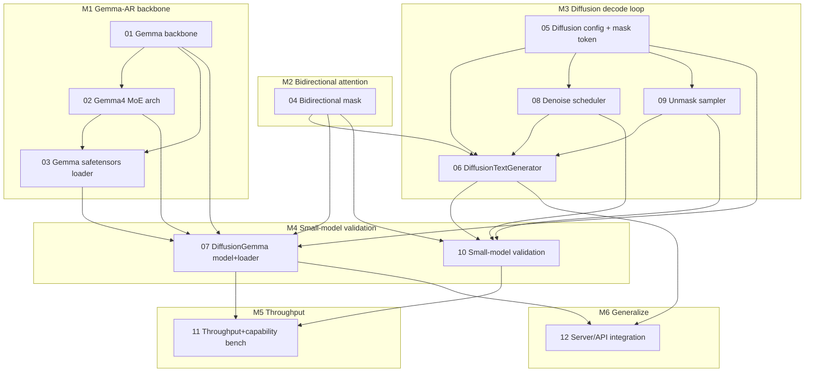

# DiffusionGemma — PR Execution Plan

Dependency-ordered sequence of PRs, grouped into 6 milestones. Each PR maps to one or a few
[proposed issues](proposed-issues/). Base HEAD = `467ea38` on `dev-diffusiongemma`.

> **Branch-base rule.** The Gemma-backbone PRs (M1) and the bidirectional-mask PR (M2) touch only
> core/CPU/loader code that exists on upstream/main → they *could* branch off `main`. Everything from
> M2's hybrid integration onward depends on the rich `dev` state (MoE forward, Gemma3 mechanisms,
> Qwen3.6 merge) → **dev-only**. Recommended: do all work on `dev-diffusiongemma` to avoid
> double-porting; note in each PR whether it is main-portable.

> **GPU rule.** No PR's CI gate requires the GPU. Correctness is CPU-only. The throughput PR (M5) runs
> GPU jobs **only** after the GPU-free guard passes (see [VALIDATION.md](VALIDATION.md)).

---

## M1 — Gemma-AR backbone correctness  *(main-portable)*
Goal: a numerically-correct dense + MoE Gemma forward (no diffusion yet).

- **PR-1** closes **#01** — embedding scale, GeGLU wiring, 4-norm layout, `(1+w)` absorption, QK-norm load.
  *Delivers:* correct dense Gemma forward. *Validated:* extended synthetic Gemma forward test
  (GeGLU/4-norm/embed-scale discriminative); no non-Gemma regressions. *Base:* main-portable.
- **PR-2** closes **#02 + #03** — Gemma 4 MoE enum/config, per-attn-type partial-rotary RoPE,
  dual KV-head counts, GeGLU MoE experts, SafeTensors Gemma/MoE tensor names + dispatch.
  *Delivers:* loadable Gemma-4-MoE dense backbone. *Validated:* synthetic Gemma-4-MoE forward (finite,
  non-degenerate logits); loader test on synthetic fixture. *Base:* dev (uses MoE forward).

## M2 — Bidirectional attention seam
Goal: the non-causal attention path, AR hot path unchanged.

- **PR-3** closes **#04** — attention-mask abstraction (Causal/Bidirectional/Hybrid), refactor
  `ApplyCausalMask` to a mask provider, thread mask mode through `Forward`.
  *Delivers:* bidirectional + hybrid attention. *Validated:* causal golden-identical test; bidirectional
  symmetry test; hybrid prefix-causal/suffix-bidirectional test; AR microbench no-regression (CPU).
  *Base:* main-portable for the kernel; integration is dev.

## M3 — Diffusion decode loop
Goal: end-to-end masked-diffusion decode on a real small checkpoint.

- **PR-4** closes **#05** — `DiffusionConfig` + mask-token resolution. *Validated:* config-parse test.
- **PR-5** closes **#08 + #09** — denoise/remask scheduler + entropy-bound unmasking sampler.
  *Validated:* schedule-value, stop-condition, entropy-ordering, determinism unit tests.
- **PR-6** closes **#06** — `DiffusionTextGenerator` (prefill → canvas → iterative denoise → multi-canvas + streaming).
  *Validated:* monotone-unmask, early-stop, multi-canvas, streaming tests on the small model (CPU).

## M4 — Small-model end-to-end validation
Goal: prove numerical correctness against an HF reference, cheaply.

- **PR-7** closes **#10** — DiffuGPT-S validation harness + canvas-logit parity + decoded-text comparison.
  *Validated:* cosine ≥ 0.999 single-forward parity vs HF dump; decoded-text within bound; CPU-only.
- **PR-8** closes **#07** — `DiffusionGemmaModel` + config extractor + loader dispatch for `diffusion_gemma`.
  *Validated:* tiny synthetic diffusion-gemma fixture loads + forwards end-to-end; real-config parse test.
  *Delivers:* the actual DiffusionGemma loads (real weights validated when GPU is free).

## M5 — Throughput / perf refinement  *(GPU-gated)*
Goal: measure + tune, comparing to the small reference + an AR baseline.

- **PR-9** closes **#11** — throughput + capability benchmark harness with the GPU-free guard.
  *Validated:* tokens/sec, denoise-steps/sec, canvas latency; AR-baseline comparison at matched
  size+quality; capability scores vs HF reference. GPU jobs gated; CPU jobs always run.

## M6 — Generalized / productionized implementation
Goal: usable through the server; refinements.

- **PR-10** closes **#12** — server/API routing to `DiffusionTextGenerator`, canvas streaming, request
  params, diffusion warm-up. *Validated:* server integration test (stream + non-stream) on the small model.
- **PR-11** (follow-up, optional) — perf refinements surfaced by M5 (canvas-KV caching, fused
  entropy/unmask kernels, GPU bidirectional attention kernel). One issue each, sized after M5 data.

---

## Dependency graph

## Critical path
`01 → 02 → 03 → 07` (Gemma backbone) and `04 → 06 → 10` (diffusion seam) run **in parallel** and join
at **07**. The longest single dependency chain is `05 → 08/09 → 06 → 10 → 11`. **04 (bidirectional
mask, XL)** is the schedule risk — start it in parallel with M1 PR-1.
